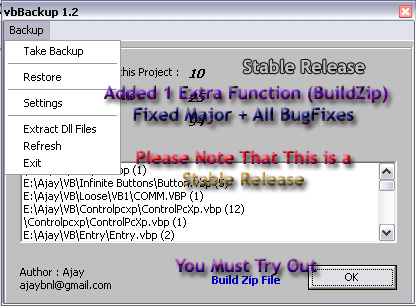



## Project Backup System \- Keep your projects safe from the silly vb6 IDE, FileSystem Errors, Changes

### Description

Added- Saves all project files in project dir.

Added- Choose which project will be Backup automatically

Added- Saves the project while backup on close.

Fixed- Bugs and errors.

Automatic Backups vb Projects. Keeps safe copies of your Project (10-unlimited). Allow you to Build zip file of Project Rapidly (For PSC Submission). Managing project backups are never been easy before. This is a must have for serious programmers.

I know my past time when i was Coding and my all data wasted due to power failure . now forget about wasting of your coding.

Please Dont Forget To Give Feedback. As i am doing work only for coding ppls.
 
### More Info
 

             |
---                |---
**Submitted On**   |2009-07-12 16:23:42
**By**             |[ajaybnl](https://github.com/Planet-Source-Code/PSCIndex/blob/master/ByAuthor/ajaybnl.md)
**Level**          |Advanced
**User Rating**    |5.0 (15 globes from 3 users)
**Compatibility**  |VB 6\.0
**Category**       |[VB function enhancement](https://github.com/Planet-Source-Code/PSCIndex/blob/master/ByCategory/vb-function-enhancement__1-25.md)
**World**          |[Visual Basic](https://github.com/Planet-Source-Code/PSCIndex/blob/master/ByWorld/visual-basic.md)
**Archive File**   |[Project\_Ba2157437132009\.zip](https://github.com/Planet-Source-Code/ajaybnl-project-backup-system-keep-your-projects-safe-from-the-silly-vb6-ide-filesystem-er__1-65979/archive/master.zip)

